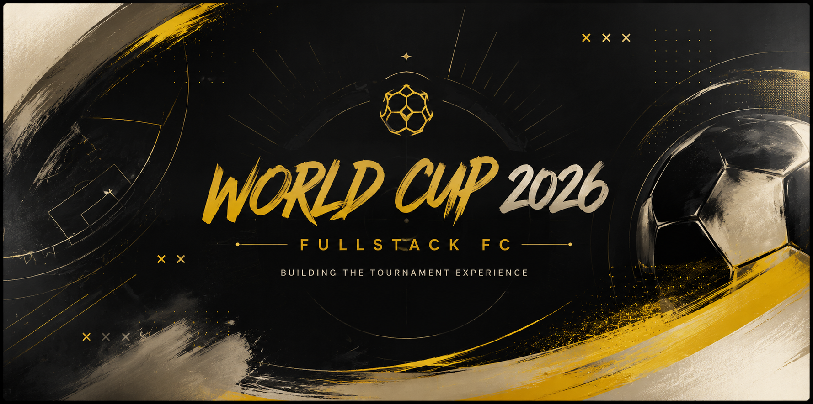

<p align="center">
  
</p>

<div align="center">

# ⚽ World Cup 2026

### FULLSTACK FC · La experiencia para seguir el Mundial, partido a partido

<a href="https://world-cup2026-sigma-weld.vercel.app/">
  
</a>
<a href="https://github.com/mxu-init/worldCup2026">
  
</a>

<br /><br />

<p align="center">
  
</p>
</div>


---

## 📖 Sobre el proyecto

**World Cup 2026** es una web creada en equipo para seguir la Copa del Mundo de fútbol de una manera clara, visual y organizada.

El proyecto reúne en un mismo lugar el calendario de encuentros, los resultados, las clasificaciones, el camino hacia la final y las estadísticas más relevantes del torneo. Hemos cuidado tanto la estructura de cada página como la experiencia de quien navega por ella.

---

## ✨ Funcionalidades

### 👋 Página de bienvenida

Portal principal con una introducción a la competición y accesos rápidos.

### 🗓️ Próximos partidos y resultados

Agenda del torneo organizada por estado:

- **Todos:** vista global del calendario.

### 📊 Clasificación por grupos

Tabla de posiciones de la fase de grupos, partidos jugados, victorias, empates, derrotas y diferencia de goles.

### 🌳 Árbol de eliminatorias

Cuadro visual e interactivo para seguir el recorrido de las selecciones hasta la final.

### 🏆 Estadísticas del torneo

Rankings principales de la competición:

- 👟 Máximos goleadores.
- ⚽ Equipos más goleadores.
- 🛡️ Equipos con más goles encajados.

---

## 🛠️ Tecnologías

<div align="center">


<br />


</div>

---

## 🧩 Estructura y diseño

Cada página se organiza con una estructura semántica clara:

```html
<header></header>
<main></main>
<footer></footer>
```

El diseño de las pantallas se ha planteado previamente en **Figma**.  
🔗 **Diseño en Figma:** (https://www.figma.com/design/mm83q9mEDb3Dwy1YMf4nGI/world-cup-26?node-id=0-1&p=f&t=5B3Lf0JyngbBrZzI-0)

---

## 🌐 Datos del torneo

Para consultar la información futbolística trabajamos con la API de [football-data.org](https://www.football-data.org/).

---

## 🤝 Forma de trabajar

Organizamos las tareas desde **GitHub Projects** y mantenemos un historial de cambios claro usando *conventional commits*.

Ejemplos:

```text
feat: añadir filtros de partidos
fix: corregir el cálculo de la clasificación
style: mejorar el diseño de la tabla de grupos
docs: actualizar la información del README
```

---

## 🚀 Despliegue

| Servicio | Enlace |
|---|---|
| GitHub Pages | https://mxu-init.github.io/worldCup2026/ |
| Vercel | [world-cup2026-sigma-weld.vercel.app](https://world-cup2026-sigma-weld.vercel.app/) |

---

## 👩‍💻 Equipo de desarrollo — FULLSTACK FC

| Desarrollador/a | GitHub | LinkedIn |
|---|---|---|
| Mauricio Rodríguez | [@mxu-init](https://github.com/mxu-init) |
| María José Rodríguez | [@mjrr39sevilla](https://github.com/mjrr39sevilla) | https://www.linkedin.com/in/maria-jose-rodriguez-ramos/ |
| Patricia Aparicio | [@apariciodiazpatricia-cell](https://github.com/apariciodiazpatricia-cell) | https://www.linkedin.com/in/patriciaapariciodiaz/ |
| Óscar Mauricio Mejía | [@oscarmmejia](https://github.com/oscarmmejia) | https://www.linkedin.com/in/oscar-mauricio-mejia |

<div align="center">

<a href="https://github.com/mxu-init/worldCup2026/graphs/contributors">
  
</a>

<br /><br />

<sub><i>El mejor resultado nace del trabajo en equipo.⚽</i></sub>

</div>
